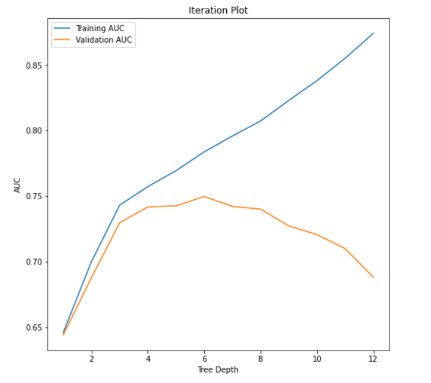

# 6301-Project

# Credit Line Increase Model Card

### Basic Information

* **Person or organization developing model**: Group 23 - Bernard Low, Kerry McKeever, Lejla Skahic, Nigel Tinotenda Nyajeka 
* **Model date**: August 2022
* **Model version**: 1.0
* **License**: MIT
* **Model implementation code**: [https://github.com/lskahic/6301-Project/blob/main/DNSC_6301_Example_Project.ipynb](DNSC_6301_Example_Project.ipynb)

### Intended Use
* **Primary intended uses**: This model is an *example* probability of default classifier, with an *example* use case for determining eligibility for a credit line increase.
* **Primary intended users**: Students in GWU DNSC 6301 bootcamp.
* **Out-of-scope use cases**: Any use beyond an educational example is out-of-scope.

### Training Data

* Data dictionary: 

| Name | Modeling Role | Measurement Level| Description|
| ---- | ------------- | ---------------- | ---------- |
|**ID**| ID | int | unique row indentifier |
| **LIMIT_BAL** | input | float | amount of previously awarded credit |
| **SEX** | demographic information | int | 1 = male; 2 = female
| **RACE** | demographic information | int | 1 = hispanic; 2 = black; 3 = white; 4 = asian |
| **EDUCATION** | demographic information | int | 1 = graduate school; 2 = university; 3 = high school; 4 = others |
| **MARRIAGE** | demographic information | int | 1 = married; 2 = single; 3 = others |
| **AGE** | demographic information | int | age in years |
| **PAY_0, PAY_2 - PAY_6** | inputs | int | history of past payment; PAY_0 = the repayment status in September, 2005; PAY_2 = the repayment status in August, 2005; ...; PAY_6 = the repayment status in April, 2005. The measurement scale for the repayment status is: -1 = pay duly; 1 = payment delay for one month; 2 = payment delay for two months; ...; 8 = payment delay for eight months; 9 = payment delay for nine months and above |
| **BILL_AMT1 - BILL_AMT6** | inputs | float | amount of bill statement; BILL_AMNT1 = amount of bill statement in September, 2005; BILL_AMT2 = amount of bill statement in August, 2005; ...; BILL_AMT6 = amount of bill statement in April, 2005 |
| **PAY_AMT1 - PAY_AMT6** | inputs | float | amount of previous payment; PAY_AMT1 = amount paid in September, 2005; PAY_AMT2 = amount paid in August, 2005; ...; PAY_AMT6 = amount paid in April, 2005 |
| **DELINQ_NEXT**| target | int | whether a customer's next payment is delinquent (late), 1 = late; 0 = on-time |

* **Source of training data**: GWU Blackboard, email `jphall@gwu.edu` for more information
* **How training data was divided into training and validation data**: 50% training, 25% validation, 25% test
* **Number of rows in training and validation data**:
  * Training rows: 15,000
  * Validation rows: 7,500

### Test Data
* **Source of test data**: GWU Blackboard, email `jphall@gwu.edu` for more information
* **Number of rows in test data**: 7,500
* **State any differences in columns between training and test data**: None

### Model details
* **Columns used as inputs in the final model**: 'LIMIT_BAL',
       'PAY_0', 'PAY_2', 'PAY_3', 'PAY_4', 'PAY_5', 'PAY_6', 'BILL_AMT1',
       'BILL_AMT2', 'BILL_AMT3', 'BILL_AMT4', 'BILL_AMT5', 'BILL_AMT6',
       'PAY_AMT1', 'PAY_AMT2', 'PAY_AMT3', 'PAY_AMT4', 'PAY_AMT5', 'PAY_AMT6'
* **Column(s) used as target(s) in the final model**: 'DELINQ_NEXT'
* **Type of model**: Decision Tree 
* **Software used to implement the model**: Python, scikit-learn
* **Version of the modeling software**: 
Python version: 3.7.13,
sklearn version: 1.0.2
* **Hyperparameters or other settings of your model**: 
```
'ccp_alpha': 0.0,
'class_weight': None,
'criterion': 'gini',
'max_depth': 6,
'max_features': None,
'max_leaf_nodes': None,
'min_impurity_decrease': 0.0,
'min_samples_leaf': 1,
'min_samples_split': 2,
'min_weight_fraction_leaf': 0.0,
'random_state': 12345,
'splitter': 'best'
```
### Quantitative Analysis

#### Variable Histograms


○ Histograms showing the distribution of each variable in the data set.

#### Correlation Heatmap


○ Heatmap shows a concerning correlation between race and predicted delinquency.


#### Initital Plot


○ Initial plot comparing training and validation AUCs. Depth 6 provides best balance of fairness and accuracy, AUCs diverge greatly after that point.


#### Training Table


○ Looking at the plot values in table form, the maximum Validation AUC does indeed occur at depth 6.


#### Test AUC
| Test AUC | 0.7438 |
| ---- | ------------- |

○ Test to see how well the model will do with completely new data. A result of 0.7438 falls within the ideal range of 0.6 to 0.9.


#### Initial AIR/AUC
| Race | AUC | AIR (to White) |
| ---- | --- | -------------- |
| White | 0.568 | - |
| Hispanic | 0.434 | 0.76 |
| Black | 0.465 | 0.82 |
| Asian | 0.568 | 1.00 |

○ For every 1000 white people that were granted credit line increaes, only 760 hispanics received the same. This is below the 80% threshold for bias, and thus a new cutoff needs to be used. An important thing to bear in mind is that while a higher cutoff provides greater accuracy, business needs means we should not stray too far from the standard of 15%.


#### Final AIR/AUC
| Race | AUC | AIR (to White) |
| ---- | --- | -------------- |
| White | 0.735 | - |
| Hispanic | 0.613 | 0.83 |
| Black | 0.626 | 0.85 |
| Asian | 0.739 | 1.00 |

○ Further calculation showed accuracy at an 18% cutoff provided balance between accuracy and business goals. Using the new cutoff, the ratio of Hispanics to Whites being approved for credit line increases above the 80% threshold.


#### Final Plot


○ Final plot including Hispanic/White AIR for testing purposes due to them being identified as the race group that had the most concerning AIR. Depth 6 continues to provide the best balance between fairness and accuracy.

Ethical considerations
There are many potential negative impacts of using our model. The data used to train this model used demographic information, which inherently brings bias into the creation of this model tree. The variables used of race and gender, for exasmple, demonstrate the concept of disparate treatment, where we are actively making a business decision to include demographic information in our models. While we addressed that we are doing this for learning purposes and this is not a model that will be published, using demographic data incorporates ingrained biases from outdated structures that discriminated against people of color, for example. While this is inherently unfair for one, it is also illegal. The members of our group could be completely discredited or heavily fined for this decision. This data decision would make our software completely wrong.  
Additionally, by working in a group of like minded graduate students, our group was at risk of succumbing to the idea of confirmation bias, as well as group think. Although we came from different backgrounds, our similar knowledge levels and lack of experience in this field brought the risk of blind agreement with our partners without considering the consequences of certain decisions. This would also put our model at risk of being completely inconclusive and wrong.
 Real world risks. For similar reasons as described above, the mistakes made in the creation of the model would cause drastic real work risks. By including data that does not include the full picture of who pays back their loans, wrong conclusions are made as to who deserves these loans resulting in discriminatory outcomes. This means loans are not dealt to well deserving people, which in turn have drastic effects on their lives, but also our economy and beyond. 
Potential Uncertainties related to the impacts of our model: Math or software/ real world risks. The potential uncertainties related to the impacts of our model are numerous. First, it should be addressed that even if we correctly avoided using demographic data, it is quite impossible to avoid incorporating variables of bias as a whole. We cannot confirm that the variables are not introducing bias. Additionally, data as a whole cannot be blindly trusted and is not objective. Data records all our mistakes, biases, regrets. Data is not always accurate, and can be miscoded, corrupted, hacked or just wrong. As mentioned above, this leads to wrong conclusions and discriminatory outcomes. 
	Initially our task was to determine how certain metrics impact whether people receive a credit line increase or not. In inspecting this data, we determined that using certain variables causes the results to be inherently biased towards certain protected groups. In order to create a more fair, yet performing model, we utilized a decision tree and determined that using a tree depth of six creates the most holistic analysis where there is lower chance of those who receive loans to default on payment, but still diminishes bias against protected groups. We focused on the hispanic to white population AIR because the ratio was below the acceptable value of 80%. The 80% value means that for every 1000 people who get their credit line increased, only 800 hispanics would receive the same result, which is the standard accepted cutoff. By increasing this cutoff of probability of default from 15% to 18%, we received both a fairer and more accurate model. 
